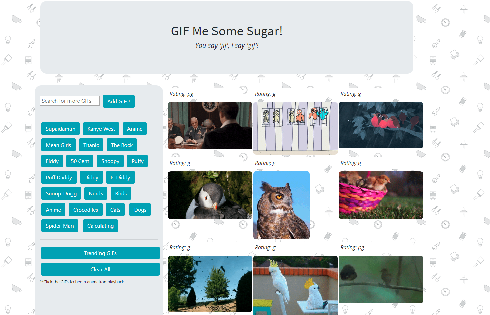

# GifTastic

This is an assignment for UC Berkeley Coding Bootcamp to create and deploy a webpage that makes Ajax calls to the Giphy API to dynamically generate GIfs according the the user's own search queries.

To create this webpage, I had to utilize jQuery and the jQuery Ajax method in order to make dynamically generated elements (both the .gif images and the buttons), and create event listeners that listened to the dynamically generated elements in order to both generate new .gif images and animate them.

---
### Technologies Used
* Git
* HTML
* CSS
    * [@Bootstrap](https://getbootstrap.com) CSS Libraray
* Javascript
    * jQuery JS Library
* [@Giphy](https://giphy.com/) API

---

